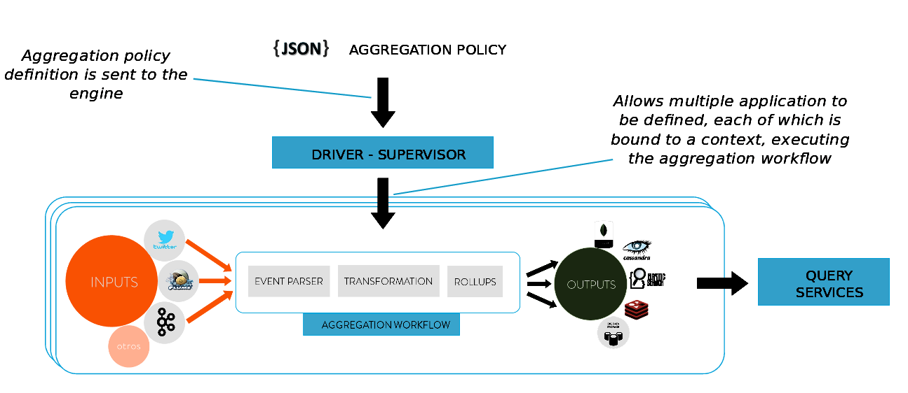

# About Stratio Sparta

Since Aryabhatta invented zero, Mathematicians such as John von Neuman have been in pursuit
of efficient counting and architects have constantly built systems that computes counts quicker. In
this age of social media, where 100s of 1000s events take place every second, we were inspired
by twitter's Rainbird project to develop a distributed aggregation engine with this high level
features:

- Pure Spark
- No need of coding, only declarative aggregation workflows
- Data continuously streamed in & processed in near real-time
- Ready to use, plug&play
- Flexible workflows (input, output, parsers, etc...)
- High performance
- Scalable
- Business Activity Monitoring
- Visualization

 [Strataconf London 2015 slideshare](http://es.slideshare.net/Stratio/strata-sparta)

Introduction
============
Social media and networking sites are  part of the fabric of everyday life, changing the way the world shares and
accesses information.
The overwhelming amount of information gathered not only from messages, updates and images but also readings
from sensors, GPS signals and many other sources was the origin of a (big) technological revolution.

This vast amount of data allows us to learn from the users and explore our own world.

We can follow in real-time the evolution of a topic, an event or even an incident just by exploring aggregated data.

 But beyond cool visualizations, there are some core services delivered in real-time, using aggregated data to
 answer common questions in the fastest way.

 These services are the heart of the business behind their nice logos.

 Site traffic, user engagement monitoring, service health, APIs, internal monitoring platforms, real-time dashboards…

 Aggregated data feeds directly to end users, publishers, and advertisers, among others.

 In Sparta we want to start delivering real-time services. Real-time monitoring could be really nice, but your
 company needs to work in the same way as digital companies:

 Rethinking existing processes to deliver them faster, better.
 Creating new opportunities for competitive advantages.

Features
========

- Highly business-project oriented
- Multiple application
- Cubes
    - Time-based
    - Secondly, minutely, hourly,  daily, monthly, yearly...
    - Hierarchical
    - GeoRange: Areas with different sizes (rectangles)
    - Flexible definition of aggregation policies (json, web app)
- Operators:
    - Max, min, count, sum, range
    - Average, median
    - Stdev, variance, count distinct
    - Last value
    - Full-text search

Architecture
============

Sparta overview
------------

Key technologies
------------
- [Spark Streaming & Spark]  (http://spark.apache.org)
- [SparkSQL] (https://spark.apache.org/sql)
- [Akka] (http://akka.io)
- [MongoDB] (http://www.mongodb.org/)
- [Apache Cassandra] (http://cassandra.apache.org)
- [ElasticSearch] (https://www.elastic.co)
- [Redis] (http://redis.io)
- [Apache Parquet] (http://parquet.apache.org/)
- [HDFS] (http://hadoop.apache.org/docs/r1.2.1/hdfs_design.html)
- [Apache Kafka] (http://kafka.apache.org)
- [Apache Flume] (https://flume.apache.org/)
- [RabbitMQ] (https://www.rabbitmq.com/)
- [Spray] (http://spray.io/)
- [KiteSDK (morphlines)] (http://kitesdk.org/docs/current)

Inputs
------------

- Twitter
- Kafka
- Flume
- RabbitMQ
- Socket

Outputs
------------

- MongoDB
- Cassandra
- ElasticSearch
- Redis
- Spark's DataFrames Outputs
- PrintOut
- CSV
- Parquet

Build
-----

You can generate rpm and deb packages by running:

`mvn clean package -Ppackage`

**Note:** you need to have installed the following programs in order to build these packages:

In a debian distribution:

  - fakeroot
  - dpkg-dev
  - rpm
  
In a centOS distribution:

  - fakeroot
  - dpkg-dev
  - rpmdevtools

Sandbox
-------------
- [All about how to start running the sandbox] (https://stratio.atlassian.net/wiki/pages/viewpage.action?pageId=2982423#id-4.HowdoIgetstarted?-4.8.2.Sandbox)

Documentation
-------------

- [Stratio Sparta](https://stratio.atlassian.net/wiki)
