About [Stratio Sparta](http://www.stratio.com/sparta)
============

At Stratio, we have implemented several real-time analytics projects based on Apache Spark, Kafka, Flume, Cassandra, ElasticSearch or MongoDB.
These technologies were always a perfect fit, but soon we found ourselves writing the same pieces of integration code over and over again.
Stratio Sparta is the easiest way to make use of the Apache Spark Streaming technology and all its ecosystem.
Choose your input, operations and outputs, and start extracting insights out of your data in real-time.

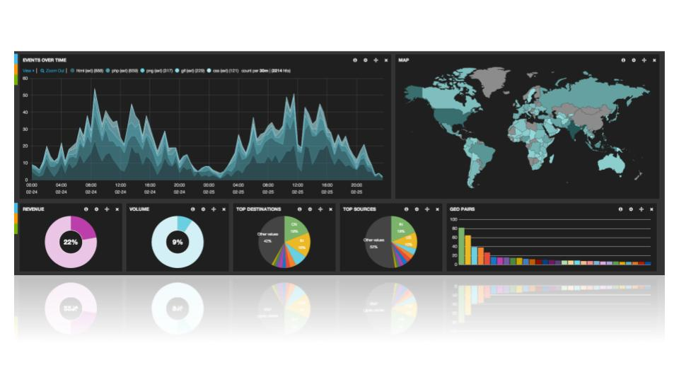

Main Features
============

- Pure Spark
- No need of coding, only declarative analytical workflows
- Data continuously streamed in & processed in near real-time
- Ready to use out-of-the-box
- Plug & play: flexible workflows (inputs, outputs, transformations, etc…)
- High performance and Fault Tolerance
- Scalable and High Availability
- Big Data OLAP on real-time to small data
- ETLs
- Triggers over streaming data
- Spark SQL language with streaming and batch data
- Kerberos and CAS compatible

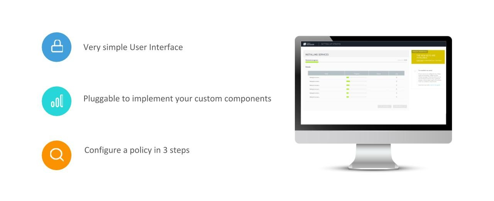

Architecture
============

Send one workflow as a JSON to Sparta API and execute in one Spark Cluster your own real-time plugins
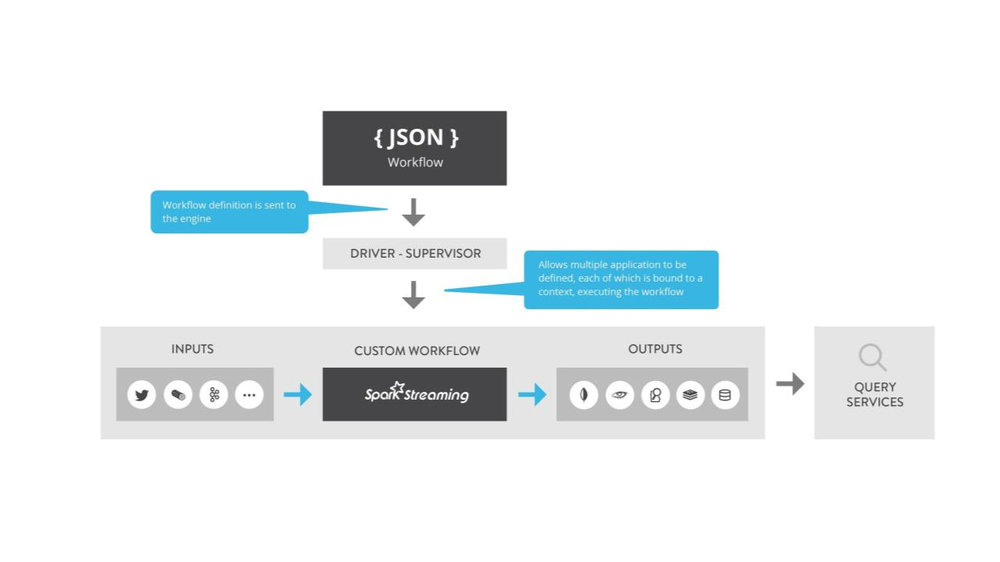

Sparta as a Job Manager
------------

Send more than one Streaming Job in the Spark Cluster and manage them with a simple UI

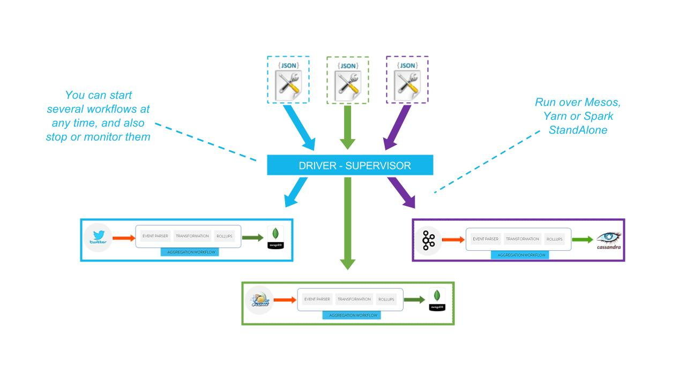

Run workflows over Mesos, Yarn or SparkStandAlone

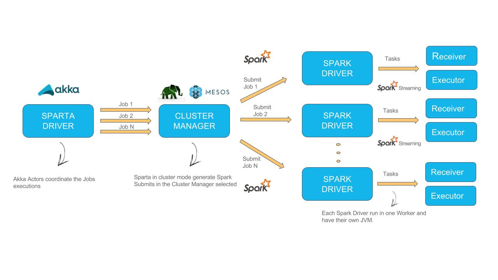

Sparta as a SDK
------------

Modular components extensible with simple SDK
- You can extend several points of the platform to fulfill your needs, such as adding new inputs, outputs, operators, transformations.
- Add new functions to Kite SDK in order to extend the data cleaning, enrichment and normalization capabilities.
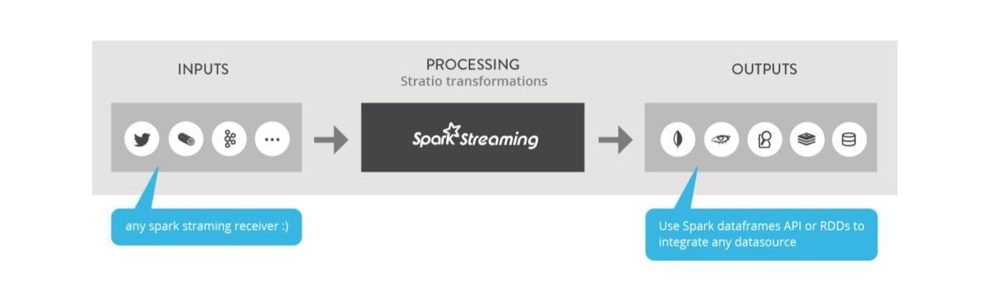

Components
========

On each workflow multiple components can be defined, but now all have the following architecture
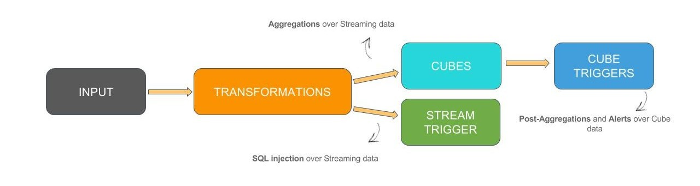
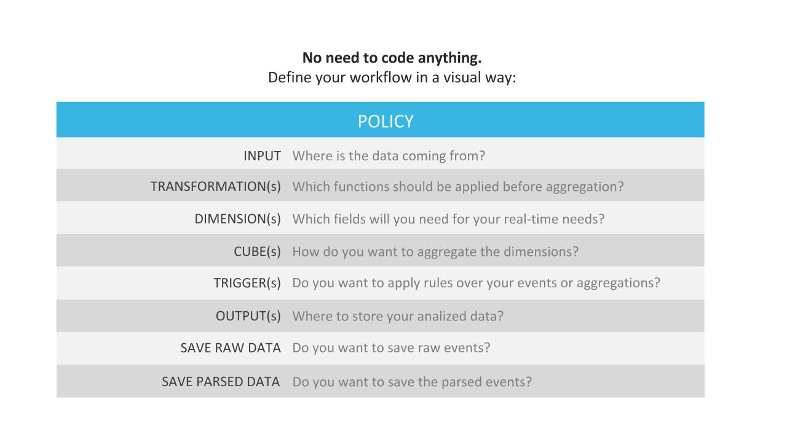

Core components
------------

Several plugins are been implemented by Stratio Sparta team
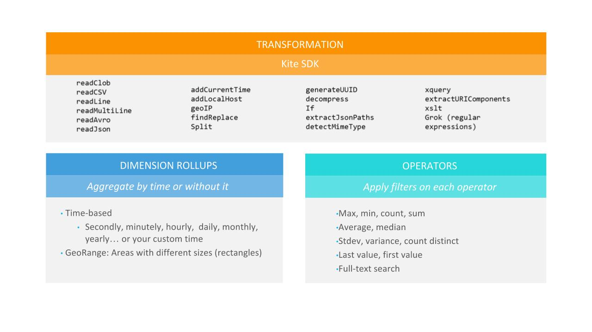

Trigger component
------------

With Sparta is possible to execute queries over the streaming data, execute ETL, aggregations and Simple Event 
Processing mixing streaming data with batch data on the trigger process. 
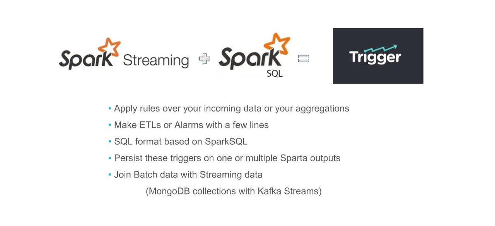

Aggregation component
------------

The aggregation process in Sparta is very powerful because is possible to generate efficient OLAP processes with 
streaming data
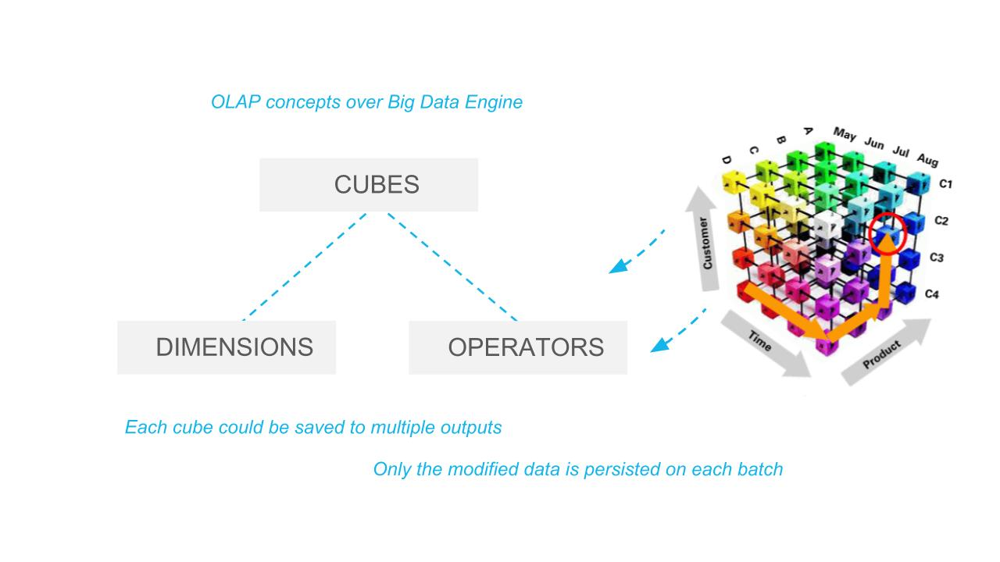

Advanced feature are been implemented in order to optimize the stateful operations over Spark Streaming
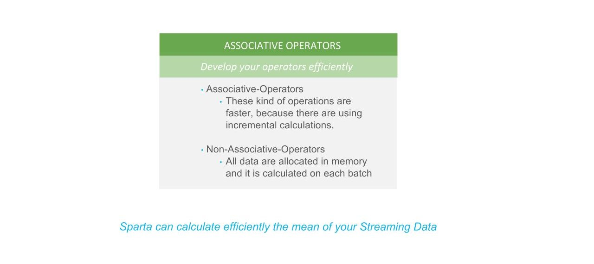

Inputs
------------

- Twitter
- Kafka
- Flume
- RabbitMQ
- Socket
- WebSocket
- HDFS/S3

Outputs
------------

- MongoDB
- Cassandra
- ElasticSearch
- Redis
- JDBC
- CSV
- Parquet
- Http
- Kafka
- HDFS/S3
- Http Rest
- Avro

Key technologies
========

- [Spark Streaming & Spark]  (http://spark.apache.org)
- [SparkSQL] (https://spark.apache.org/sql)
- [Akka] (http://akka.io)
- [MongoDB] (http://www.mongodb.org/)
- [Apache Cassandra] (http://cassandra.apache.org)
- [ElasticSearch] (https://www.elastic.co)
- [Redis] (http://redis.io)
- [Apache Parquet] (http://parquet.apache.org/)
- [HDFS] (http://hadoop.apache.org/docs/r1.2.1/hdfs_design.html)
- [Apache Kafka] (http://kafka.apache.org)
- [Apache Flume] (https://flume.apache.org/)
- [RabbitMQ] (https://www.rabbitmq.com/)
- [Spray] (http://spray.io/)
- [KiteSDK (morphlines)] (http://kitesdk.org/docs/current)
- [Apache Avro] (https://avro.apache.org/)

Advantages
========

Sparta provide several advantages to final Users
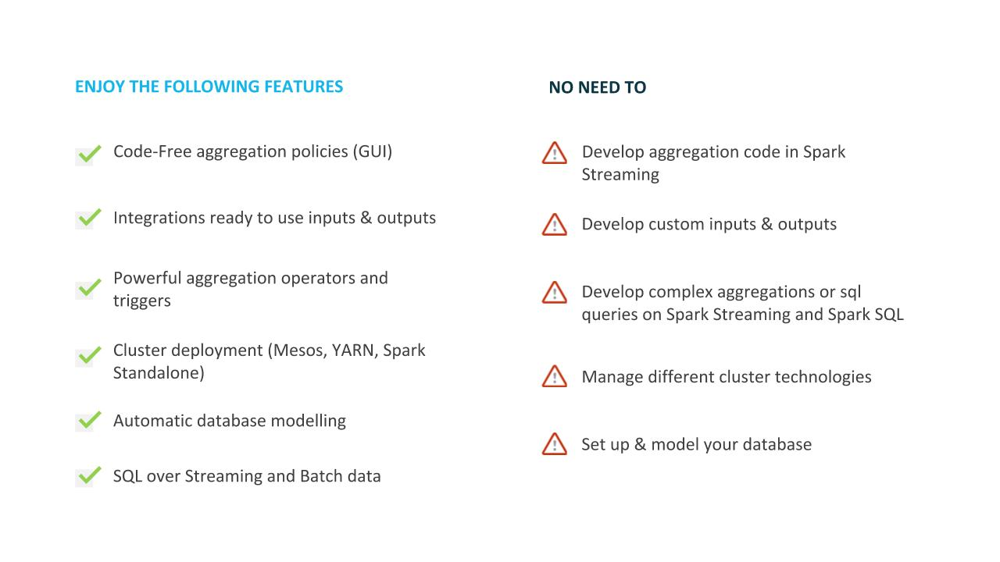

Build
========

You can generate rpm and deb packages by running:

`mvn clean package -Ppackage`

**Note:** you need to have installed the following programs in order to build these packages:

In a debian distribution:

  - fakeroot
  - dpkg-dev
  - rpm
  
In a centOS distribution:

  - fakeroot
  - dpkg-dev
  - rpmdevtools
  
In all distributions:

  - Java 8
  - Maven 3

Documentation
========

- [Stratio Sparta](https://stratio.atlassian.net/wiki/spaces/SPARTA1x1x2)

License
========

Licensed to STRATIO (C) under one or more contributor license agreements.
See the NOTICE file distributed with this work for additional information
regarding copyright ownership.  The STRATIO (C) licenses this file
to you under the Apache License, Version 2.0 (the
"License"); you may not use this file except in compliance
with the License.  You may obtain a copy of the License at

  http://www.apache.org/licenses/LICENSE-2.0

Unless required by applicable law or agreed to in writing,
software distributed under the License is distributed on an
"AS IS" BASIS, WITHOUT WARRANTIES OR CONDITIONS OF ANY
KIND, either express or implied.  See the License for the
specific language governing permissions and limitations
under the License.
