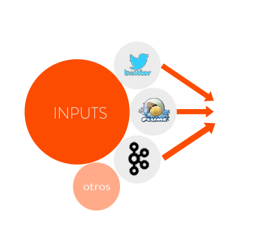
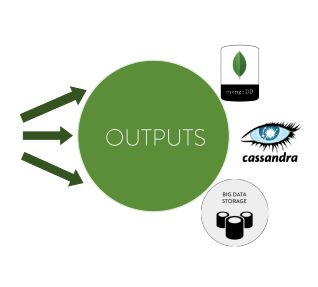

About Stratio Sparkta
******************

Since Aryabhatta invented zero, Mathematicians such as John von Neuman have been in pursuit
of efficient counting and architects have constantly built systems that computes counts quicker. In
this age of social media, where 100s of 1000s events take place every second, we were inspired
by twitter's Rainbird project to develop a distributed aggregation engine with this high level
features:

- Pure Spark
- Data continuously streamed in & processed in near real-time
- Ready to use, plug&play
- Flexible workflows (input, output, parsers, etc...)
- High performance
- BAM ready
- Visualization

Introduction
============

Features
========

- Highly business-project oriented
- Community engagement from zero day
- Separate storage and query layers
- Multiple application
- Aggregation:
    - Several operators (min, max, count, distinct, inc, dec...)
    - Automatic rollups (MINUTELY,HOURLY,DAILY,MONTHLY)
    - Hierarchical counting
    - Flexible definition of aggregation policies (json, web app?)
- Querying
    - Automatic REST api
    - In memory data cube
    - Extend sparkSQL to allow MDX queries

Architecture
============

Sparkta overview
------------
.. figure:: images/sparkta1.png
   :alt: Spark Architecture Overview

Architectures used
------------

- `Apache Kafka <http://kafka.apache.org>`__
- `Spark Streaming & Spark <http://spark.apache.org>`__
- `MongoDB <http://www.mongodb.org/>`__
- `Cassandra <http://cassandra.apache.org>`__
- `Redis <http://redis.io>`__
- `Elasticsearch <https://www.elastic.co>`__
- `KiteSDK (morphlines) <http://kitesdk.org/docs/current>`__
- `SparkSQL <https://spark.apache.org/sql>`__
- `akka <http://akka.io>`__
- `HDFS <http://hadoop.apache.org/docs/r1.2.1/hdfs_design.html>`__
- `RabbitMQ <https://www.rabbitmq.com/>`__
- `Apache Flume <https://flume.apache.org/>`__
- `Spray <http://spray.io/>`__
- `Apache Parquet <http://parquet.apache.org/>`__

Inputs
------------

- Twitter
- Kafka
- Flume
- RabbitMQ
- Socket

Outputs
------------

- MongoDB
- PrintOut
- Cassandra
- Redis
- Elasticsearch
- Spark's Dataframes

