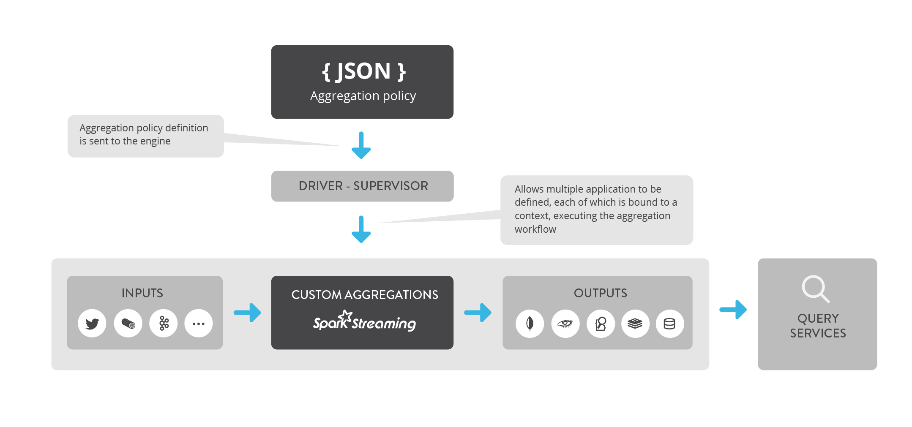
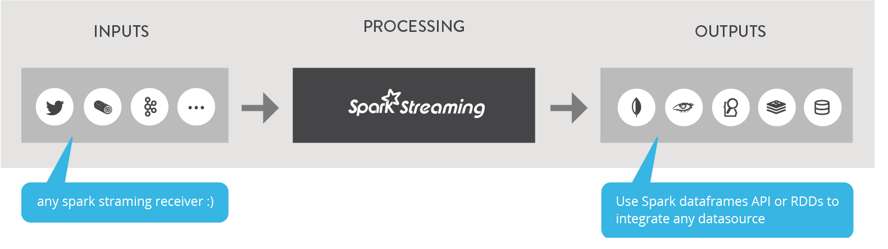

Architecture Guide
******************

Sparkta overview
===========
The figure below explains how the flow works. Actually it's pretty simple. first of all we have an input source of data of the given inputs, then this data will be parsed and custom aggregated. After the aggregations it's time to store the data in one of the given databases.

Key Components
=============

Sparkta relies on the best technologies in the market right now. The combination of all of these components are the heart of Sparkta.

- `Spark Streaming & Spark <http://spark.apache.org>`__
- `SparkSQL <https://spark.apache.org/sql>`__
- `Akka <http://akka.io>`__
- `MongoDB <http://www.mongodb.org/>`__
- `Apache Cassandra <http://cassandra.apache.org>`__
- `ElasticSearch <https://www.elastic.co>`__
- `Redis <http://redis.io>`__
- `Apache Parquet <http://parquet.apache.org/>`__
- `HDFS <http://hadoop.apache.org/docs/r1.2.1/hdfs_design.html>`__
- `Apache Kafka <http://kafka.apache.org>`__
- `Apache Flume <https://flume.apache.org/>`__
- `Spray <http://spray.io/>`__
- `KiteSDK (morphlines) <http://kitesdk.org/docs/current>`__

Inputs
=============

Input sources are at the beginning of the flow since without them we wouldn't have data to aggregate. We already designed several inputs for you to work with. In case that any of those doesn't fit for you, you can create custom inputs.

- `Twitter <inputs.html#twitter-label>`__
- `Kafka <inputs.html#kafka-label>`__
- `Kafka-Direct <inputs.html#kafkadirect-label>`__
- `Flume <inputs.html#flume-label>`__
- `Socket <inputs.html#socket-label>`__

Outputs
=============

Output databases are designed to store our aggregated data after being processed.

- `MongoDB <outputs.html#mongodb-label>`__
- `Cassandra <outputs.html#cassandra-label>`__
- `ElasticSearch <outputs.html#elasticsearch-label>`__
- `Redis <outputs.html#redis-label>`__
- `Print <outputs.html#print-label>`__
- `Parquet <outputs.html#parquet-label>`__
- `Csv <outputs.html#csv-label>`__
