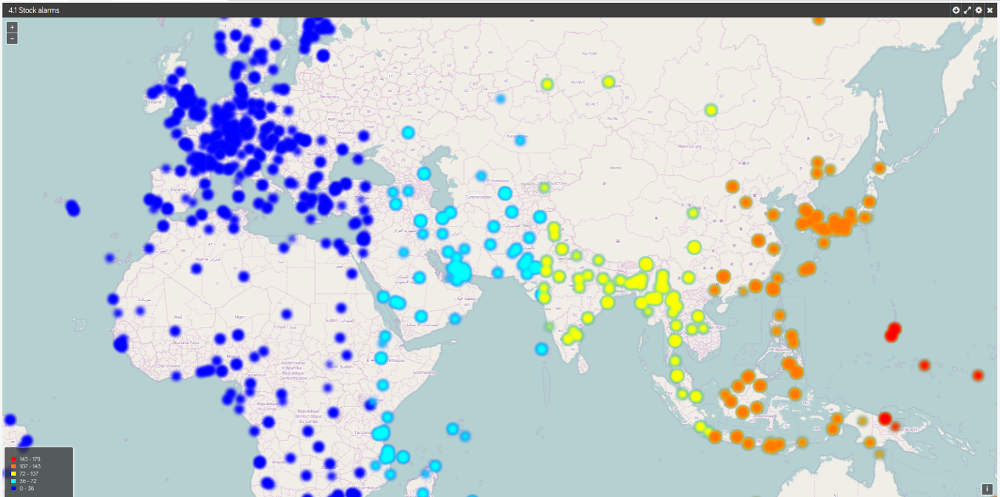
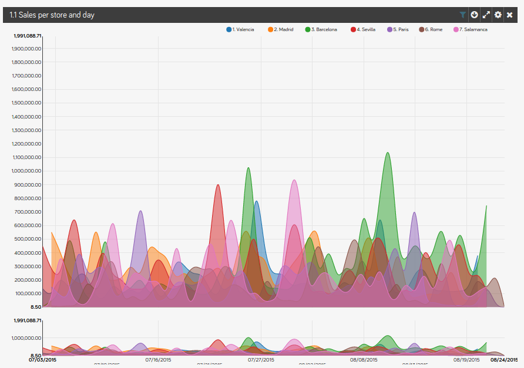
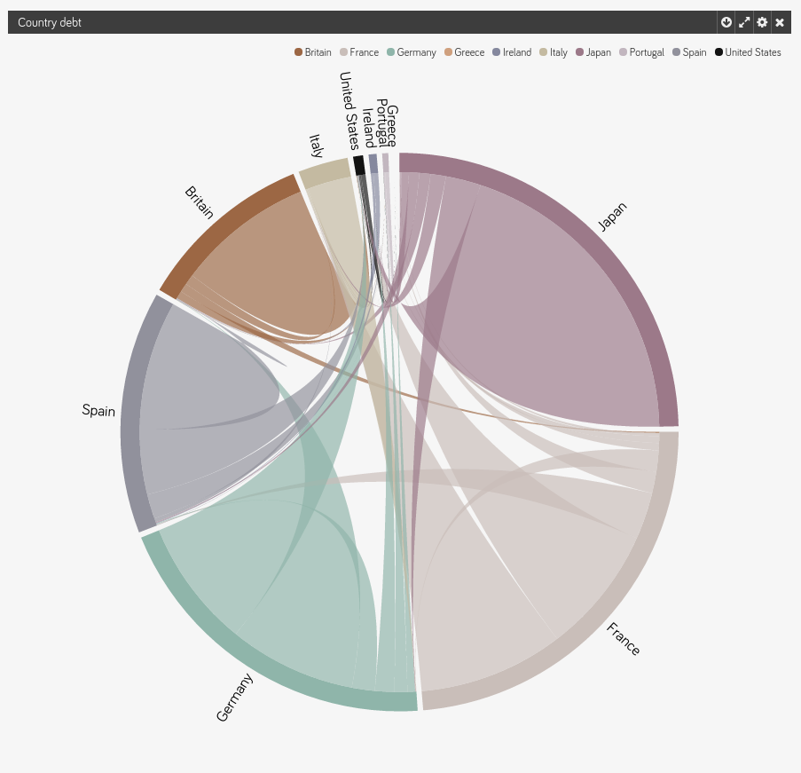
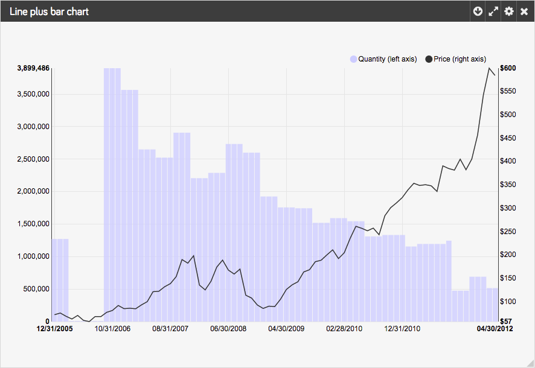

Sparkta in the Stratio platform
******************

Currently Sparkta is one the keys of the Stratio Platform. The real time aggregation of data and the use of the operators are the reasons.

**PUT A MAP OF THE PLATFORM**

Modules that Sparkta uses
====================

- Stratio Ingestion is the module in charge to enrich the input event with useful information and also drop the data that it's not important. Then they become the input source of Sparkta.

Modules that use Sparkta
====================

- Stratio Viewer is the module in charge of the visualization of the data. Their input is Sparkta output. Viewer go to the output database to find the data that Sparkta has previously aggregated. Here you can see a few examples of what they do with the aggregated data coming from Sparkta.

