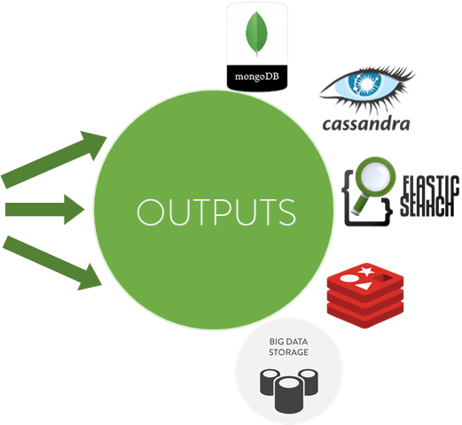

Outputs Configurations
************************

- :ref:`generic-label`

- :ref:`mongodb-label`

- :ref:`cassandra-label`

- :ref:`elasticsearch-label`

- :ref:`redis-label`

- :ref:`print-label`

- :ref:`parquet-label`

.. _generic-label:

Generic Configuration
=======================

In the SDK you can find the model that must follow an output to be implemented.It has several settings that can modify system operation.

These parameters can be completed in the policy file:

+-----------------------+----------------------------------------------------------+----------+-----------------------+
| Property              | Description                                              | Optional | Default               |
+=======================+==========================================================+==========+=======================+
| multiplexer           | If it's enabled it will generate tables corresponding    | Yes      | false                 |
|                       | to all possible combinations of the dimensions.          |          |                       |
+-----------------------+----------------------------------------------------------+----------+-----------------------+
| replication_factor    | Required if class is SimpleStrategy; otherwise, not used | Yes      | 1                     |
|                       | The parameter specifies the number of replicas of data   |          |                       |
|                       | on multiple nodes.                                       |          |                       |
+-----------------------+----------------------------------------------------------+----------+-----------------------+
| fixedDimensions       | You can specify dimensions that will be fixed to         | Yes      | ""                    |
|                       | calculate the multiplexer. This way you can obtain       |          |                       |
|                       | fixed dimensions and a small number of tables and        |          |                       |
|                       | possibilities.                                           |          |                       |
+-----------------------+----------------------------------------------------------+----------+-----------------------+
| fieldsSeparator       | The character that separate the fields to the others     | Yes      | ,                     |
|                       | parameters.                                              |          |                       |
+-----------------------+----------------------------------------------------------+----------+-----------------------+
| isAutoCalculateId     | If it's true it will generate the primary key of the     | Yes      | false                 |
|                       | register with the value of the dimensions and the        |          |                       |
|                       | dimensionTime                                            |          |                       |
+-----------------------+----------------------------------------------------------+----------+-----------------------+
| fixedAggregation      | It's possible to specify one fixed aggregation with      | Yes      | None                  |
|                       | value for all dimensions.                                |          |                       |
+-----------------------+----------------------------------------------------------+----------+-----------------------+

.. _mongodb-label:

MongoDB Configuration
==========================

The output of MongoDB doesn't use the generic implementation with DataFrames, it has multiple configuration
parameters to connect to the DB and self-creation of indexes.

+-----------------------+----------------------------------------------------+----------+---------------------------+
| Property              | Description                                        | Optional | Default                   |
+=======================+====================================================+==========+===========================+
| clientUri             | This parameter connection routes specified the     | Yes      | mongodb://localhost:27017 |
|                       | nodes of a cluster of MongoDB, with different      |          |                           |
|                       | replica set or with sharding.                      |          |                           |
+-----------------------+----------------------------------------------------+----------+---------------------------+
| dbName                | The name of the database                           | Yes      | "sparkta"                 |
+-----------------------+----------------------------------------------------+----------+---------------------------+
| connectionsPerHost    | Number of connections per host                     | Yes      | 5                         |
+-----------------------+----------------------------------------------------+----------+---------------------------+
| threadsAllowedToBlock | This multiplier, multiplied with the               | Yes      | 10                        |
|                       | connectionsPerHost setting, gives the maximum      |          |                           |
|                       | number of threads that may be waiting for a        |          |                           |
|                       | connection to become available from the pool.      |          |                           |
+-----------------------+----------------------------------------------------+----------+---------------------------+
| idAsField             | Is possible to save all fields that compound the   | Yes      | false                     |
|                       | unique key as a independent field.                 |          |                           |
+-----------------------+----------------------------------------------------+----------+---------------------------+
| textIndexFields       | The system is capable of insert data in a full-text| Yes      |                           |
|                       | index. All of this fields compound the index.      |          |                           |
+-----------------------+----------------------------------------------------+----------+---------------------------+
| language              | Specify the language of the tokenizer in the       | Yes      | None                      |
|                       | full-text index in MongoDB, each document          |          |                           |
|                       | inserted must have this key-value.                 |          |                           |
+-----------------------+----------------------------------------------------+----------+---------------------------+
| retrySleep            | The number of milliseconds to wait for reconnect   | Yes      | 1000                      |
|                       | with MongoDb nodes when the last client fails. It  |          |                           |
|                       | is recommendable to set less time to the slide     |          |                           |
|                       | interval of the streaming window.                  |          |                           |
+-----------------------+----------------------------------------------------+----------+---------------------------+

.. _cassandra-label:

Cassandra Configuration
==============================

The output of Cassandra use the generic implementation with DataFrames, this implementation transform each
UpdateMetricOperation to Row type of Spark and identify each row with his schema.

+-----------------------+----------------------------------------------------------+----------+-----------------------+
| Property              | Description                                              | Optional | Default               |
+=======================+==========================================================+==========+=======================+
| connectionHost        | Different seeds of a cluster of Cassandra.               | Yes      | Yes                   |
+-----------------------+----------------------------------------------------------+----------+-----------------------+
| cluster               | The name of the cluster.                                 | Yes      | Yes                   |
+-----------------------+----------------------------------------------------------+----------+-----------------------+
| keyspace              | The name of the KeySpace                                 | Yes      | Yes                   |
+-----------------------+----------------------------------------------------------+----------+-----------------------+
| keyspaceClass         | The class of KeySpace.                                   | Yes      | SimpleStrategy        |
|                       |  * SimpleStrategy: Use it only for a single data center. |          |                       |
|                       |    SimpleStrategy places the first replica on a node     |          |                       |
|                       |    determined by the partitioner.Additional replicas     |          |                       |
|                       |    are placed on the next nodes clockwise in the         |          |                       |
|                       |    cassandra's ring without considering any topology     |          |                       |
|                       |    (rack or datacenter location).                        |          |                       |
|                       |  * NetworkTopologyStrategy:Use NetworkTopologyStrategy   |          |                       |
|                       |    when you have (or plan to have) your cluster deployed |          |                       |
|                       |    across multiple data centers. This strategy specifies |          |                       |
|                       |    how many replicas you want in each data center.       |          |                       |
+-----------------------+----------------------------------------------------------+----------+-----------------------+
| replication_factor    | Required if class is SimpleStrategy; otherwise, not used | Yes      | 1                     |
|                       | The parameter specifies the number of replicas of data   |          |                       |
|                       | on multiple nodes.                                       |          |                       |
+-----------------------+----------------------------------------------------------+----------+-----------------------+
| compactStorage        | The compact storage directive is used for backward       | Yes      | None                  |
|                       | compatibility of CQL 2 applications and data in the      |          |                       |
|                       | legacy (Thrift) storage engine format. To take advantage |          |                       |
|                       | of CQL 3 capabilities, do not use this directive in new  |          |                       |
|                       | applications. When you create a table using compound     |          |                       |
|                       | primary keys, for every piece of data stored,            |          |                       |
|                       | he column name needs to be stored along with it.         |          |                       |
|                       | Instead of each non-primary key column being stored      |          |                       |
|                       | such that each column corresponds to one column on disk, |          |                       |
|                       | an entire row is stored in a single column on disk,      |          |                       |
|                       | hence the name compact storage.                          |          |                       |
+-----------------------+----------------------------------------------------------+----------+-----------------------+
| clusteringDimensions  | Clustering columns for the primary key.                  | Yes      |                       |
+-----------------------+----------------------------------------------------------+----------+-----------------------+
| indexFields           | The indexed fields, could be any aggregate field         | Yes      |                       |
|                       | or clustering column field.                              |          |                       |
+-----------------------+----------------------------------------------------------+----------+-----------------------+
| textIndexFields       | The text index fields, this feature is for the Stratio's | Yes      |                       |
|                       |  Cassandra Lucene Index                                  |          |                       |
+-----------------------+----------------------------------------------------------+----------+-----------------------+
| analyzer              | The analyzer for text index fields, this feature is for  | Yes      | None                  |
|                       | the Stratio's Cassandra Lucene Index                     |          |                       |
+-----------------------+----------------------------------------------------------+----------+-----------------------+
| refreshSeconds        | The number of seconds between refresh lucene index       | Yes      | 1                     |
|                       | operations, this feature is for the Stratio's Cassandra  |          |                       |
|                       | Lucene Index                                             |          |                       |
+-----------------------+----------------------------------------------------------+----------+-----------------------+
| dateFormat            | The date format for the date fields indexed, this        | Yes      | yyyy/mm/dd            |
|                       | feature is for the Stratio's Cassandra Lucene Index      |          |                       |
+-----------------------+----------------------------------------------------------+----------+-----------------------+

.. _elasticsearch-label:

ElasticSearch Configuration
==============================

The output of ElasticSearch use the generic implementation with DataFrames, this implementation transform each
UpdateMetricOperation to Row type of Spark and identify each row with his schema.

+--------------------------+-----------------------------------------------+----------+-----------------------+
| Property                 | Description                                   | Optional | Default               |
+==========================+===============================================+==========+=======================+
| nodes                    | Nodes of a cluster of ElasticSearch.          | Yes      | localhost             |
+--------------------------+-----------------------------------------------+----------+-----------------------+
| defaultPort              | The port to connect with ElasticSearch.       | Yes      | 9200                  |
+--------------------------+-----------------------------------------------+----------+-----------------------+
| idField                  | Field used as unique id for the row.          | Yes      | "id"                  |
+--------------------------+-----------------------------------------------+----------+-----------------------+
| indexMapping             | Field used as mapping for the index.          | Yes      | "sparkta"              |
+--------------------------+-----------------------------------------------+----------+-----------------------+
| dateType                 | The type of the date fields.                  | Yes      | None                  |
+--------------------------+-----------------------------------------------+----------+-----------------------+

.. _redis-label:

Redis Configuration
====================

The output of Redis doesn't use the generic implementation with DataFrames.

+--------------------------+-----------------------------------------------+----------+-----------------------+
| Property                 | Description                                   | Optional | Default               |
+==========================+===============================================+==========+=======================+
| hostname                 | The Ip of a Redis host.                       | Yes      | localhost             |
+--------------------------+-----------------------------------------------+----------+-----------------------+
| port                     | The port to connect with ElasticSearch.       | Yes      | 9200                  |
+--------------------------+-----------------------------------------------+----------+-----------------------+

.. _print-label:

Print Configuration
====================

The print output uses the generic implementation with DataFrames, this implementation print each dataframe with his
 schema.

.. _parquet-label:

Parquet Configuration
====================

The parquet output uses generic implementation of DataFrames.

+--------------------------+-----------------------------------------------+----------+-----------------------+
| Property                 | Description                                   | Optional | Default               |
+==========================+===============================================+==========+=======================+
| path                     | Destination path to store info.               | No       |                       |
+--------------------------+-----------------------------------------------+----------+-----------------------+
