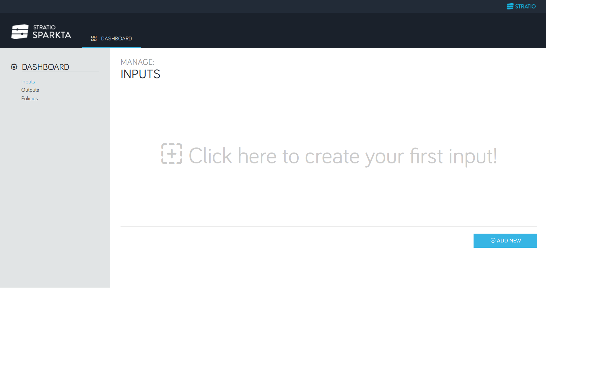
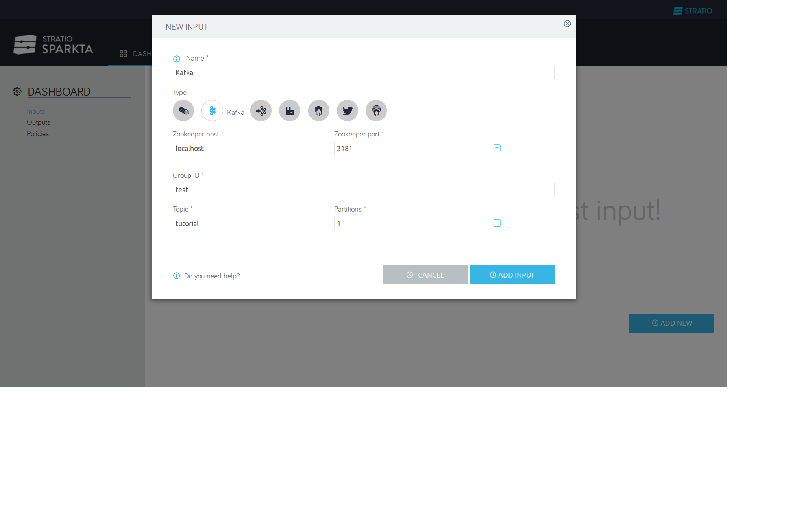
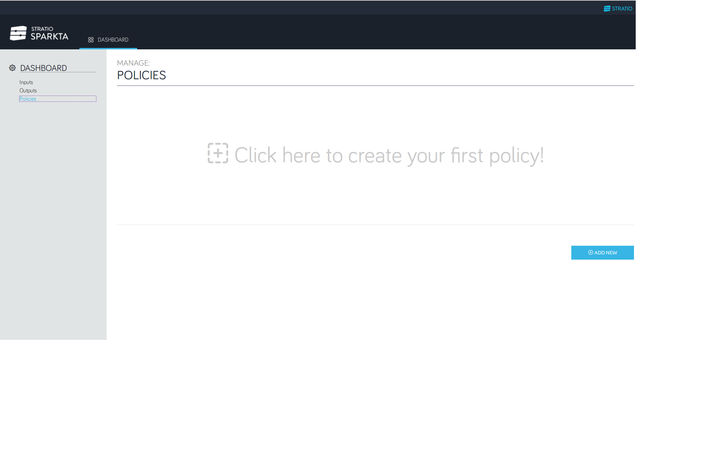
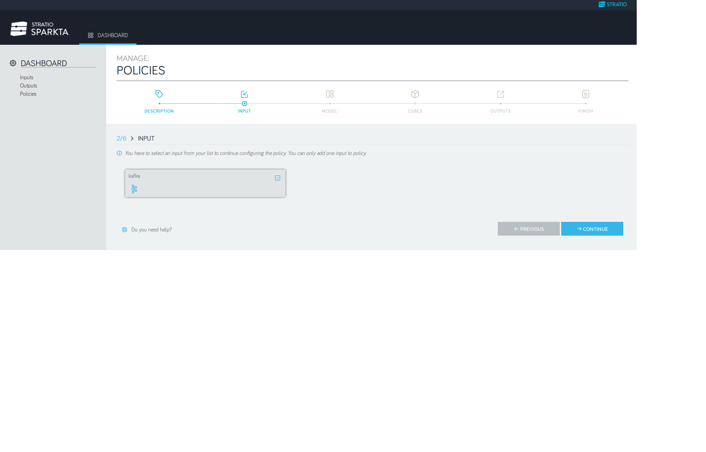
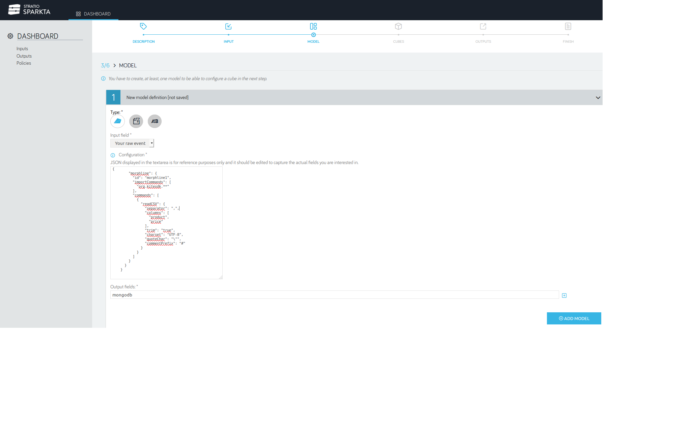
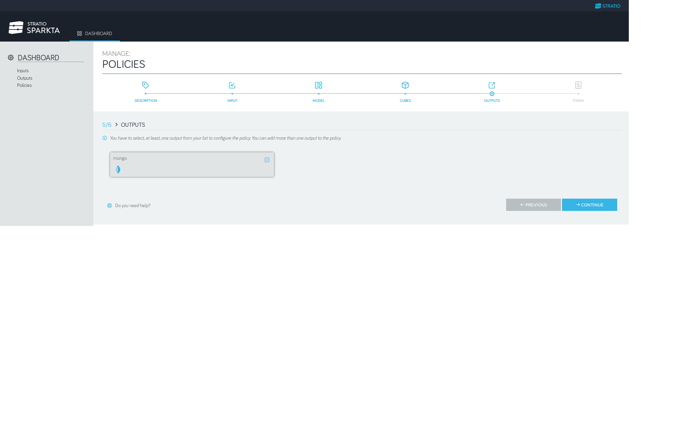
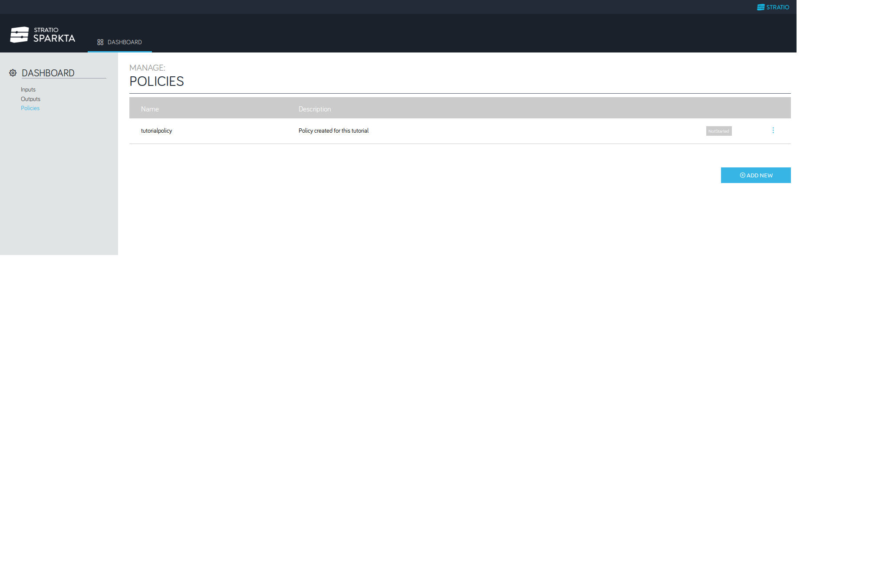
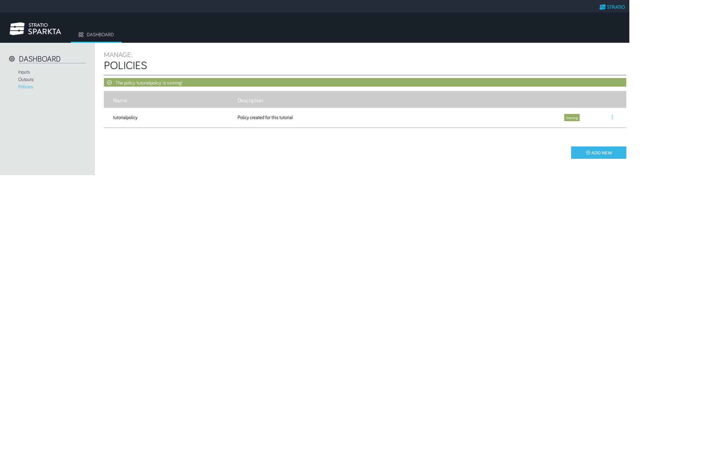

Creating a policy using the GUI
*********************

This step by step guide will help you out to create a policy from the beginning.

* Step 1:

In the first step We have to decide the input source that we want. Click in **ADD NEW**.

* Step 2:

In this tutorial We are going to use Kafka as our input source of data. After selecting it click in **ADD INPUT**.

* Step 3:

Then We have to select which database are We going to use to store all the data. Click in **ADD NEW**.

.. image:: images/policyWithGUI/3.png
   :height: 700 px
   :width:  1100 px
   :scale:  75 %
   :align: left

* Step 4:

In this case, our database will be MongoDB. Click in **ADD OUTPUT**.

.. image:: images/policyWithGUI/4.png
   :height: 700 px
   :width:  1100 px
   :scale:  75 %
   :align: left

* Step 5:

Once you have created the input and the output it's time to set up the policy. Click in **ADD NEW**.

* Step 6:

Now we have to select the input that we have created before. Click in **CONTINUE**.

.. image:: images/policyWithGUI/6.png
   :height: 700 px
   :width:  1100 px
   :scale:  75 %
   :align: left

* Step 7:

Now we have to select the output that we have created before. Click in **CONTINUE**.

* Step 8:

This could be the most difficult step, we have to create a model. A model is the way we are going to parse the data that is coming through our input source. In this example we are using a Morphline parser that will expect the data in the following format: **Product,Price**. Then in the output field text box we have to put the fields that we are going to work with later. Check the Step 9 image.

* Step 9:

Our output fields are **Product** and **Price**. CLick in **ADD MODEL**.

.. image:: images/policyWithGUI/9.png
   :height: 700 px
   :width:  1100 px
   :scale:  75 %
   :align: left

* Step 10:

In this Step we have to create the cubes. The cubes are formed with the output fields that we created in the previous step. In this case we are just going to use the **Product**. Note that the name of the output fields will be the name of the database.

.. image:: images/policyWithGUI/10.png
   :height: 700 px
   :width:  1100 px
   :scale:  75 %
   :align: left

* Step 11:

Select **Product** and click in **SAVE**.

.. image:: images/policyWithGUI/11.png
   :height: 700 px
   :width:  1100 px
   :scale:  75 %
   :align: left

* Step 12:

As you already should now, operators are one of the most powerful features that Sparkta can offer. In this example we are going to use the Max operator. The output field that we want to apply the Max operator will be the **Price**. Click in **SAVE**.

.. image:: images/policyWithGUI/12.png
   :height: 700 px
   :width:  1100 px
   :scale:  75 %
   :align: left

* Step 13:

Click in **ADD CUBE**

.. image:: images/policyWithGUI/13.png
   :height: 700 px
   :width:  1100 px
   :scale:  75 %
   :align: left

* Step 14:

Select the output that we have created before. Click in **CONTINUE**.

* Step 15:

Now we are ready to run our policy.

* Step 16:

Click on **Run**.

.. image:: images/policyWithGUI/16.png
   :height: 700 px
   :width:  1100 px
   :scale:  75 %
   :align: left

* Step 17:

Policy is starting.

* Step 18:

Policy is started.

.. image:: images/policyWithGUI/18.png
   :height: 700 px
   :width:  1100 px
   :scale:  75 %
   :align: left